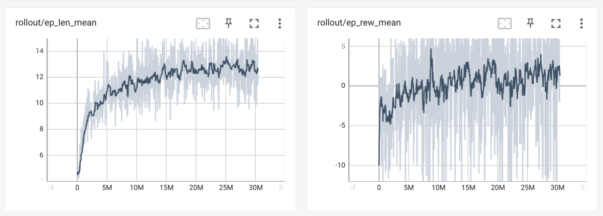

# Reinforcement Learning progress and results
## Comparison table
| Model | Acc | Rec (Macro-avg) | Prec (Macro-avg) | F1 (Macro-avg) | Details |
| - | - | - | - | - | - |
| Seq (ANN) | 81.7% | 48.3% | 76.4% | 49.1% | 5 hidden layers, vanilla |
| Seq (Ann) | 67.8% | 59.7% | 47.9% | 43.1% | 5 hidden layers, with class weighted training |
| PPO (RL) | 72.8% | 52.2% | 44.8% | 44.7% | 14M steps, biased reward to minorities |
| PPO (RL) | 73.1% | 52.8% | 45.3% | 45.7% | 29.8M steps, biased reward to minorities |
| Multi PPO (RL) | -% | -% | -% | -% | Work in progress. One agent per class which trains on a binary classification task. One final agent which trains based on the previous agents' prediction |
| DQN | 75.4% | 47.0% | 46.0% | 43.6% | Work in progress. 1.8M steps, biased rewards to very reduced minorities |

## Last Reinforcement Learning rollout

