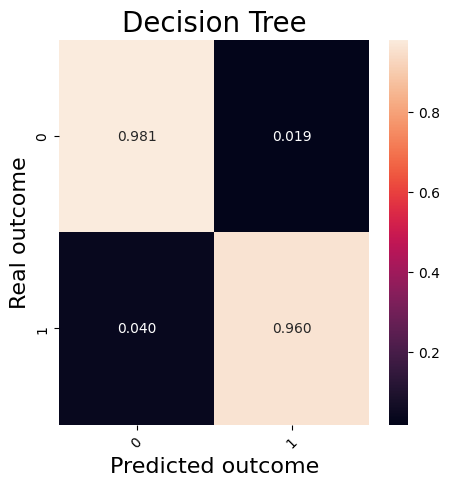
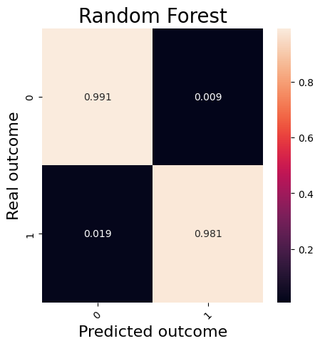
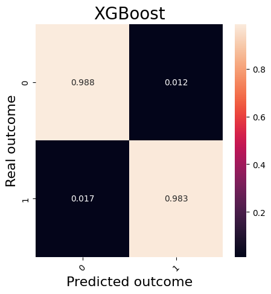
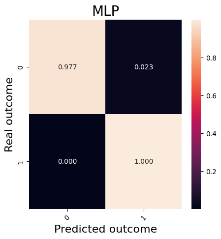

# Contenidos
## Proyecto y objetivo

Diseño de un modelo de IA explicativa basado en aprendizaje por refuerzo aplicado al dataset UNSW-NB15

El trabajo tiene como objetivo el diseño del modelo indicado en el título a un nivel básico, sin realizar un estudio exhaustivo sobre los parámetros implicados que
podrían mejorar los resultados del modelo y bajo un enfoque de clasificación binaria. Se indicará el procedimiento completo realizado, así como las decisiones tomadas y los resultados obtenidos. Por último, se realizará una comparación respecto a otros modelos bajo circunstancias similares (modificación mínima o nula de parámetros) en cuanto a métricas obtenidas, así como
un análisis comparativo sobre la naturaleza explicativa implícita a cada modelo. También se incluirá en la comparativa trabajos relacionados al respecto.

Los modelos que se han trabajado son los siguientes, a los cuales se ha aplicado un factor de pesos de clases basado en el desequilibrio de estos en el split de entrenamiento:

| Familia/metodología del modelo | Modelo | Framework | Características |
| - | - | - | - |
| Basado en árboles | Decision Tree | Scikit-learn | Por defecto |
| Ensamblado | Random Forest | Scikit-learn | Por defecto |
| Boosting de ensamblado de árboles | XGBoost | XGBoost | Por defecto |
| Perceptrón multicapa | Sequential Dense Layers | Keras (Tensorflow) | Doble capa de 64 unidades |
| Aprendizaje por refuerzo | Proximal Policy Optimization | Stable-Baselines3 (PyTorch) | Doble capa de 64 unidades para actor y crítico |

## Comparación de métricas obtenidas de los modelos
Los resultados se han obtenido utilizando ```average='Binary'```.

| Model | Accuracy | Recall | Precision | F1 |
| - | - | - | - | - |
| Decision Tree | 97.71% | 95.99% | 92.11% | 94.01% |
| Random Forest | 98.30% | 98.07% | 96.41% | 97.23% |
| XGBoost | 98.73% | 98.26% | 95.16% | 96.68% |
| Sequential Dense Layers | 98.17% | 99.98% | 91.43% | 95.51% |
| Proximal Policy Optimization | 97.79% | 99.96% | 89.84% | 94.63% |

<p align="center">
  
</p>

<p align="center">
  
</p>

<p align="center">
  
</p>

<p align="center">
  
</p>

<p align="center">
  
</p>


