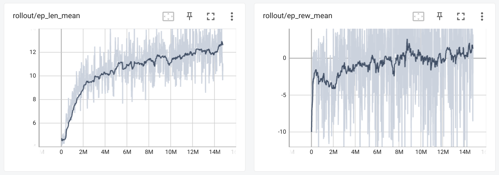

# Reinforcement Learning progress and results
## Comparison table
| Model | Acc | Rec (Macro-avg) | Prec (Macro-avg) | F1 (Macro-avg) | Details |
| - | - | - | - | - | - |
| Seq (ANN)| 81.7% | 48.3% | 76.4% | 49.1% | 5 hidden layers |
| PPO (RL) | 72.8% | 52.2% | 44.8% | 44.7% | 14M steps |

## Latest Reinforcement Learning rollout

